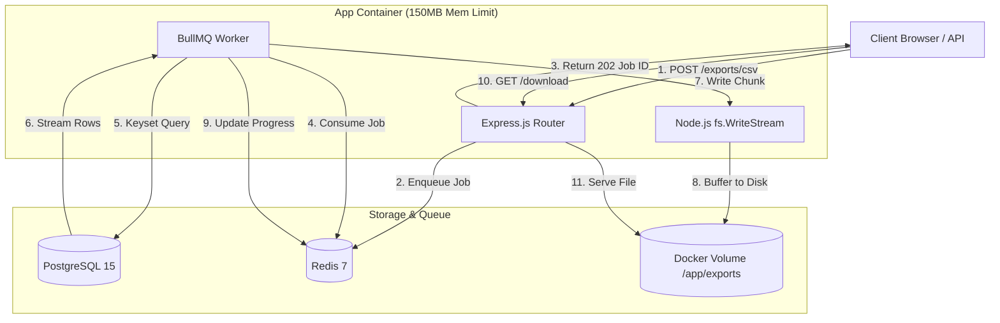
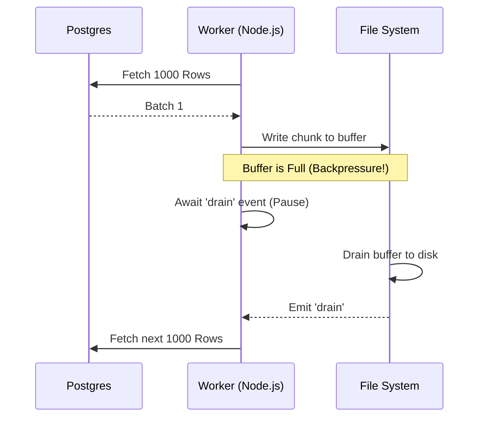

# System Architecture

The Async Streaming Export Service is designed to handle massive datasets (e.g., 10 million rows) without ever holding the dataset in memory. It achieves this through a combination of **asynchronous I/O**, **streaming**, **backpressure**, **keyset pagination**, and a **message queue**.

## High-Level Architecture

The system is broken into three main containers:

1. **App Container (Node.js)**: Handles incoming HTTP requests and runs the background Worker processes.
2. **Database Container (PostgreSQL 15)**: Stores the actual data and enforces relational integrity.
3. **Queue Container (Redis 7)**: Stores background job state and brokers tasks between the API and the Worker.



## Core Concepts Explained

### 1. Asynchronous I/O

Node.js is single-threaded but uses an event loop to handle non-blocking I/O. When a file is written or a database is queried, Node doesn't wait (block) for the disk or network. It registers a callback and movies on to processing other API requests (like `/health` checks or `/status` polls).

### 2. Backpressure

When reading from a fast source (Postgres) and writing to a slower destination (File System / Disk), the intermediate buffer can fill up and crash the app with an Out Of Memory (OOM) error.

**How we solve it:**
We listen to the `drain` event. If `csvStringifier.write(row)` returns `false` (meaning the internal buffer is full), the worker _pauses_ fetching from the database until the file system catches up.



### 3. Keyset Pagination (Seek Method)

Traditional offsets (`OFFSET 5000000`) must scan and discard 5 million rows before returning row 5,000,001.
Database Cursors (`DECLARE CURSOR`) are faster, but they hold a long-running transaction open for the entire multi-minute export, tying up connection pool resources and risking transaction timeouts.

**How we solve it:**
We use stateless Keyset Pagination.

```sql
SELECT * FROM users WHERE id > $last_seen_id ORDER BY id ASC LIMIT 1000
```

This is a standard B-Tree index lookup. It executes instantly, releases the database connection back to the pool, and then the worker sleeps while it processes the rows. When it needs more rows, it checks out a new connection and asks for `id > 1000`.

### 4. Background Jobs & Redis

If a server crashes mid-export, in-memory jobs are lost forever. By using **BullMQ backed by Redis**, the job queue is durable. It handles retries, concurrency limits (we limit to 3 parallel exports), and persists job state so clients can still poll their status even if the Node container restarted.
