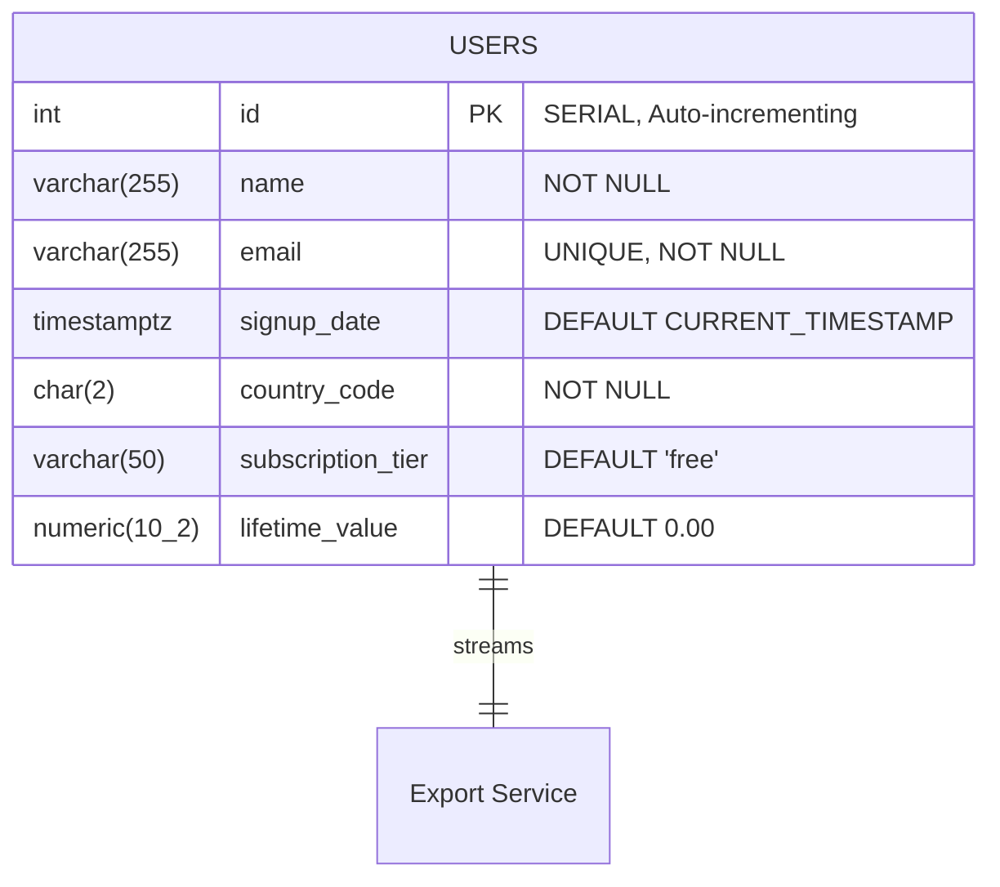

# Database Schema

The database relies on PostgreSQL 15. The core focus of this schema is high-throughput read operations and allowing fast index lookups during export filtering.

## Entity Relationship Diagram (ERD)



## Schema Implementation (`init.sql`)

The database is initialized by placing an `init.sql` script into the `/docker-entrypoint-initdb.d/` folder of the Postgres container.

### Indexes for Filtering

The `POST /exports/csv` endpoint accepts three optimal filters. Our database requires three independent B-Tree indexes to ensure scanning 10 million rows remains Performant.

1. **Country Code**

```sql
CREATE INDEX idx_users_country_code ON users(country_code);
```

2. **Subscription Tier**

```sql
CREATE INDEX idx_users_subscription_tier ON users(subscription_tier);
```

3. **Lifetime Value**

```sql
CREATE INDEX idx_users_lifetime_value ON users(lifetime_value);
```

### Seeding Strategy

Normal loops block the CPU and are too slow to insert 10 million rows during a Docker container startup (`docker-compose up`).

We utilize **PostgreSQL's built in `generate_series()` function**. This runs the loop entirely inside the database C code, which easily handles millions of rows per minute without needing any external script:

```sql
INSERT INTO users (name, email, signup_date, country_code, subscription_tier, lifetime_value)
SELECT
    'User ' || i,
    'user' || i || '@example.com',
    NOW() - (random() * (INTERVAL '5 years')),
    (ARRAY['US', 'UK', 'IN', 'FR', 'DE'])[floor(random() * 5 + 1)],
    (ARRAY['free', 'basic', 'premium', 'enterprise'])[floor(random() * 4 + 1)],
    round((random() * 1000)::numeric, 2)
FROM generate_series(1, 10000000) AS s(i);
```
